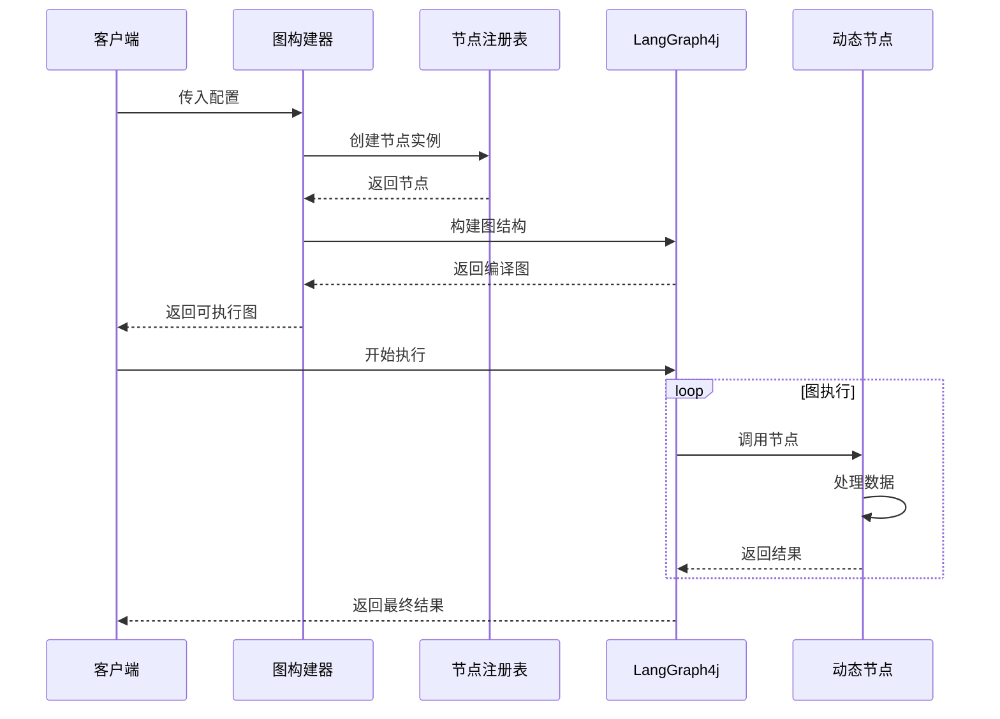

# 多租户动态图架构设计文档

## 🏛️ 系统架构

### 分层架构

```
┌─────────────────────────────────────────────────────────────────┐
│                        用户接口层                                │
├─────────────────────────────────────────────────────────────────┤
│                        配置管理层                                │
│  ┌─────────────────┐  ┌─────────────────┐  ┌─────────────────┐ │
│  │  JSON配置服务    │  │  配置验证服务    │  │  配置版本管理    │ │
│  └─────────────────┘  └─────────────────┘  └─────────────────┘ │
├─────────────────────────────────────────────────────────────────┤
│                        业务逻辑层                                │
│  ┌─────────────────┐  ┌─────────────────┐  ┌─────────────────┐ │
│  │  图构建服务      │  │  节点注册服务    │  │  路由管理服务    │ │
│  └─────────────────┘  └─────────────────┘  └─────────────────┘ │
├─────────────────────────────────────────────────────────────────┤
│                        执行引擎层                                │
│  ┌─────────────────┐  ┌─────────────────┐  ┌─────────────────┐ │
│  │  LangGraph4j     │  │  状态管理       │  │  结果收集       │ │
│  └─────────────────┘  └─────────────────┘  └─────────────────┘ │
├─────────────────────────────────────────────────────────────────┤
│                        数据存储层                                │
│  ┌─────────────────┐  ┌─────────────────┐  ┌─────────────────┐ │
│  │  配置存储       │  │  状态持久化      │  │  日志存储       │ │
│  └─────────────────┘  └─────────────────┘  └─────────────────┘ │
└─────────────────────────────────────────────────────────────────┘
```

## 🧩 核心组件设计

### 1. DynamicState (状态管理核心)

```java
┌─────────────────────────────────────┐
│           DynamicState              │
├─────────────────────────────────────┤
│ + MESSAGES_KEY: String              │
│ + DATA_KEY: String                  │  
│ + SCHEMA: Map<String, Channel<?>>   │
├─────────────────────────────────────┤
│ + getMessages(): List<String>       │
│ + getDataAsString(): String         │
│ + updateData(Object): void          │
│ + addMessage(String): void          │
└─────────────────────────────────────┘
```

**设计理念**:
- **通用性**: 支持任意类型的消息和数据
- **类型安全**: 基于LangGraph4j的Channel机制
- **扩展性**: 易于添加新的状态字段

### 2. DynamicNode (节点抽象)

```java
┌─────────────────────────────────────┐
│          <<interface>>              │
│           DynamicNode               │
├─────────────────────────────────────┤
│ + execute(state, params): Map       │
│ + getNodeType(): String             │
└─────────────────────────────────────┘
                    △
                    │ implements
        ┌───────────┼───────────┐
        │           │           │
┌─────────────┐ ┌─────────────┐ ┌─────────────┐
│   LogNode   │ │UpperCaseNode│ │ AppendNode  │
├─────────────┤ ├─────────────┤ ├─────────────┤
│ +execute()  │ │ +execute()  │ │ +execute()  │
│ +getType()  │ │ +getType()  │ │ +getType()  │
└─────────────┘ └─────────────┘ └─────────────┘
```

**设计原则**:
- **单一职责**: 每个节点专注于一个功能
- **参数化**: 通过params实现行为配置
- **无状态**: 节点本身不保存状态信息

### 3. NodeRegistry (节点工厂)

```java
┌─────────────────────────────────────┐
│          NodeRegistry               │
├─────────────────────────────────────┤
│ - nodeFactories: Map<String,        │
│                     Supplier<Node>> │
├─────────────────────────────────────┤
│ + register(type, factory): void     │
│ + createNode(type): DynamicNode     │
│ + isSupported(type): boolean        │
│ - initializeBuiltinNodes(): void    │
└─────────────────────────────────────┘
```

**工厂模式优势**:
- **解耦**: 节点创建与使用分离
- **扩展**: 运行时注册新节点类型  
- **性能**: 延迟初始化，按需创建

### 4. DynamicGraphBuilder (图构建器)

```java
┌─────────────────────────────────────┐
│       DynamicGraphBuilder           │
├─────────────────────────────────────┤
│ - nodeRegistry: NodeRegistry        │
├─────────────────────────────────────┤
│ + buildGraph(config): CompiledGraph │
│ - addNodeToGraph(graph, node): void │
│ - addEdgesToGraph(graph, edges): void│
│ - addSingleEdge(graph, edge): void  │
└─────────────────────────────────────┘
```

**构建流程**:
```
配置解析 → 节点创建 → 边连接 → 图编译 → 执行就绪
```

## 🏢 多租户架构

### 租户隔离模型

```
                    ┌─────────────────┐
                    │  租户管理器      │
                    └─────────┬───────┘
                              │
        ┌─────────────────────┼─────────────────────┐
        │                     │                     │
┌─────────────┐      ┌─────────────┐      ┌─────────────┐
│   租户A      │      │   租户B      │      │   租户C      │
├─────────────┤      ├─────────────┤      ├─────────────┤
│ 配置A.json   │      │ 配置B.json   │      │ 配置C.json   │  
│ 图实例A      │      │ 图实例B      │      │ 图实例C      │
│ 状态A        │      │ 状态B        │      │ 状态C        │
└─────────────┘      └─────────────┘      └─────────────┘
```

### 隔离层次
1. **配置隔离**: 每个租户独立的JSON配置文件
2. **运行时隔离**: 独立的图实例和状态
3. **资源隔离**: 内存和计算资源隔离  
4. **数据隔离**: 执行结果和日志隔离

## 📄 配置系统设计

### 配置结构层次

```
TenantGraphConfig
├── tenantId (租户标识)
├── graphName (图名称)  
├── nodes[] (节点配置列表)
│   ├── id (节点唯一ID)
│   ├── type (节点类型)
│   └── params{} (参数映射)
└── edges[] (边配置列表)
    ├── from (源节点)
    ├── to (目标节点)
    ├── condition (条件表达式)
    └── conditional (是否条件边)
```

### 配置验证机制

```java
┌─────────────────────────────────────┐
│        配置验证流程                  │
├─────────────────────────────────────┤
│ 1. JSON语法验证                     │
│ 2. 字段完整性检查                   │
│ 3. 节点类型存在性验证               │
│ 4. 边连接有效性检查                 │
│ 5. 参数类型兼容性验证               │
│ 6. 图拓扑结构验证                   │
└─────────────────────────────────────┘
```

## 🔄 执行流程

### 图执行生命周期



### 状态流转

```
初始状态 → 节点1处理 → 中间状态1 → 节点2处理 → 中间状态2 → ... → 最终状态
```

每个状态包含:
- **messages**: 执行日志列表  
- **data**: 当前处理的数据
- **metadata**: 元数据信息

## 🔧 扩展点设计

### 1. 节点扩展

```java
// 自定义节点实现
public class CustomBusinessNode implements DynamicNode {
    @Override
    public Map<String, Object> execute(Map<String, Object> state, 
                                     Map<String, Object> params) {
        // 业务逻辑实现
    }
    
    @Override 
    public String getNodeType() {
        return "customBusinessNode";
    }
}

// 注册扩展节点
nodeRegistry.register("customBusinessNode", CustomBusinessNode::new);
```

### 2. 配置扩展

```java
// 扩展配置类
public class ExtendedNodeConfig extends NodeConfig {
    private String businessType;
    private Map<String, Object> businessParams;
    // ... getters/setters
}
```

### 3. 状态扩展

```java
// 扩展状态类
public class BusinessDynamicState extends DynamicState {
    public static final String BUSINESS_DATA_KEY = "businessData";
    
    // 扩展Schema
    public static final Map<String, Channel<?>> EXTENDED_SCHEMA = Map.of(
        MESSAGES_KEY, Channels.appender(ArrayList::new),
        DATA_KEY, Channels.base(() -> ""),
        BUSINESS_DATA_KEY, Channels.base(HashMap::new)
    );
}
```

## 🛡️ 错误处理策略

### 异常分类

```
GraphException
├── ConfigurationException (配置异常)
│   ├── InvalidNodeTypeException
│   ├── InvalidParameterException  
│   └── InvalidGraphStructureException
├── ExecutionException (执行异常)
│   ├── NodeExecutionException
│   ├── StateTransitionException
│   └── TimeoutException  
└── ResourceException (资源异常)
    ├── MemoryLimitException
    └── ConcurrencyLimitException
```

### 错误恢复机制

```java
┌─────────────────────────────────────┐
│           错误处理策略              │
├─────────────────────────────────────┤
│ 1. 节点级重试                       │
│ 2. 替代节点执行                     │
│ 3. 跳过节点继续                     │
│ 4. 整体回滚                         │
│ 5. 人工干预                         │
└─────────────────────────────────────┘
```

## 📈 性能优化

### 优化策略

1. **图编译缓存**: 相同配置的图只编译一次
2. **节点实例池**: 复用节点实例减少GC
3. **状态对象池**: 复用状态对象  
4. **异步执行**: 支持异步节点执行
5. **并行处理**: 无依赖节点并行执行

### 性能监控

```java
┌─────────────────────────────────────┐
│          性能监控指标               │
├─────────────────────────────────────┤
│ • 图构建时间                        │
│ • 图执行时间                        │  
│ • 内存使用量                        │
│ • 并发执行数                        │
│ • 错误率统计                        │
│ • 吞吐量指标                        │
└─────────────────────────────────────┘
```

## 🔒 安全设计

### 安全层次

1. **配置安全**: JSON配置权限控制
2. **执行安全**: 节点执行沙箱隔离
3. **数据安全**: 敏感数据加密存储
4. **访问安全**: API认证和授权
5. **审计安全**: 操作日志记录

### 权限模型

```
权限矩阵
         │ 查看 │ 创建 │ 修改 │ 删除 │ 执行 │
─────────┼─────┼─────┼─────┼─────┼─────┤
系统管理员│  ✓  │  ✓  │  ✓  │  ✓  │  ✓  │
租户管理员│  ✓  │  ✓  │  ✓  │  ✓  │  ✓  │
业务用户  │  ✓  │  ✗  │  ✗  │  ✗  │  ✓  │
只读用户  │  ✓  │  ✗  │  ✗  │  ✗  │  ✗  │
```

## 📚 总结

本架构设计文档详细阐述了多租户动态图系统的核心架构、组件设计、扩展机制和优化策略。该架构具备以下特点:

- **高内聚低耦合**: 模块职责清晰，依赖关系简单
- **可扩展性**: 支持节点、配置、状态多维度扩展  
- **高性能**: 多层优化保证系统高效运行
- **高可靠**: 完善的错误处理和安全机制

该架构为构建企业级智能工作流引擎提供了坚实的设计基础。

---

**文档版本**: v1.0  
**更新日期**: 2025年11月26日  
**设计状态**: 架构设计完成，持续优化中
